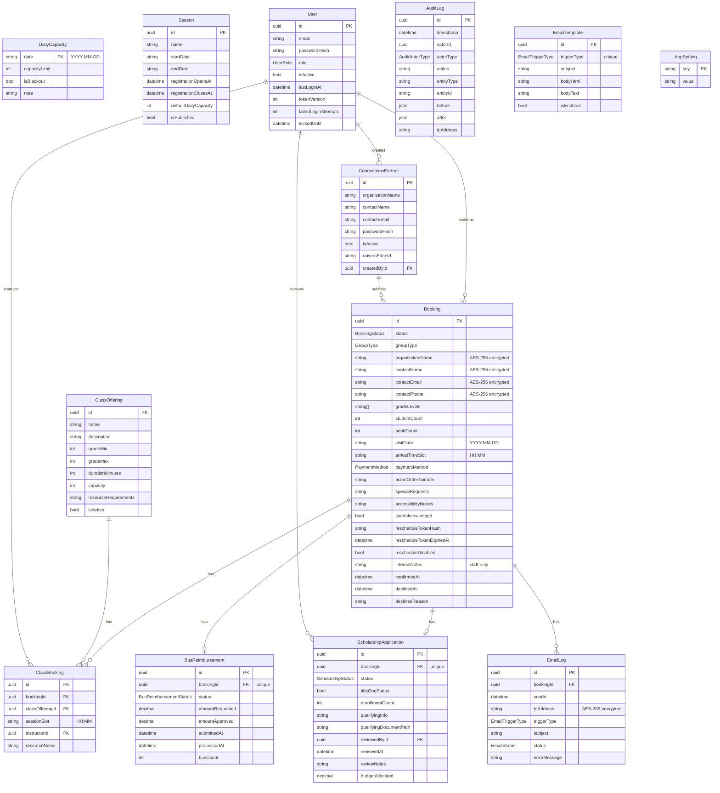

# Tidebook — Architecture

## Overview

Tidebook is a web-based group registration and booking management system for the Seattle Aquarium's School and Public Programs department. It replaces a fragmented manual process (YouCanBookMe, Excel, Outlook, email) with a single integrated system.

**Stack:**
- **Frontend:** React 18, TypeScript, Tailwind CSS, Vite, React Query, React Hook Form
- **Backend:** Node.js, Express, TypeScript
- **Database:** PostgreSQL 16 with Prisma ORM
- **Auth:** JWT (access + refresh tokens) with `tokenVersion`-based revocation
- **Email:** Nodemailer + SMTP with DKIM signing
- **Container:** Docker + Docker Compose + Nginx

---

## System Diagram

```
                         ┌─────────────────────────────┐
                         │         Nginx (reverse proxy)│
                         │  Port 80 / 443               │
                         └────────┬──────────┬──────────┘
                                  │          │
                    ┌─────────────▼──┐  ┌───▼────────────────┐
                    │  React SPA     │  │  Express API        │
                    │  /             │  │  /api/v1/…          │
                    │  (static HTML) │  │  Port 4000          │
                    └────────────────┘  └────────┬───────────┘
                                                 │
                              ┌──────────────────▼──────────┐
                              │         PostgreSQL           │
                              │         Port 5432            │
                              └─────────────────────────────┘
```

**Three public entry points:**
1. `/book` — public booking flow (no login required)
2. `/reschedule?token=…` — self-serve rescheduling (token-authenticated)
3. `/connections` — Connections Partner portal (email + password)
4. `/admin` — Staff admin dashboard (JWT-authenticated)

---

## Data Model (ER Diagram)



---

## API Surface

### Public (no auth required)
| Method | Path | Description |
|--------|------|-------------|
| GET | `/api/v1/public/availability` | Calendar availability with per-day capacity |
| GET | `/api/v1/public/classes` | Active class offerings |
| GET | `/api/v1/public/classes/availability` | Class slot availability for a date |
| POST | `/api/v1/public/bookings` | Submit a new group booking |
| GET | `/api/v1/public/bookings/reschedule` | Get booking info by reschedule token |
| POST | `/api/v1/public/bookings/reschedule` | Reschedule via token |
| POST | `/api/v1/public/bookings/cancel` | Cancel via token |

### Auth
| Method | Path | Description |
|--------|------|-------------|
| POST | `/api/v1/auth/login` | Staff login → access + refresh tokens |
| POST | `/api/v1/auth/refresh` | Rotate refresh token → new access token |
| POST | `/api/v1/auth/logout` | Revoke session (increment tokenVersion) |

### Admin (JWT required)
| Method | Path | Description |
|--------|------|-------------|
| GET | `/api/v1/admin/bookings` | Paginated, filtered booking list |
| GET | `/api/v1/admin/bookings/:id` | Single booking with email logs |
| POST | `/api/v1/admin/bookings/:id/confirm` | Confirm pending booking |
| POST | `/api/v1/admin/bookings/:id/decline` | Decline with reason |
| PATCH | `/api/v1/admin/bookings/:id/notes` | Update internal notes |
| PATCH | `/api/v1/admin/bookings/:id/disable-reschedule` | Disable self-serve reschedule link |
| POST | `/api/v1/admin/bookings/:id/acme-retry` | Retry ACME push |
| GET | `/api/v1/admin/dvl` | Daily Visit Log (JSON or CSV) |
| GET | `/api/v1/admin/scholarships` | Scholarship applications |
| POST | `/api/v1/admin/scholarships/:id/review` | Approve / deny |
| GET/POST/PUT | `/api/v1/admin/classes` | Class offering CRUD |
| GET/POST/PUT | `/api/v1/admin/seasons` | Season CRUD |
| GET/PUT | `/api/v1/admin/capacity/:date` | Per-date capacity override |
| GET/POST/PATCH | `/api/v1/admin/users` | User management |
| POST | `/api/v1/admin/users/:id/force-logout` | Revoke all sessions |
| GET/PUT | `/api/v1/admin/email-templates` | Email template management |
| GET/PUT | `/api/v1/admin/settings` | App settings |
| GET | `/api/v1/admin/audit-log` | Audit log viewer |
| GET | `/api/v1/admin/analytics/bookings` | Booking analytics |

### Connections Partners
| Method | Path | Description |
|--------|------|-------------|
| POST | `/api/v1/connections/auth/login` | Partner login |
| POST | `/api/v1/connections/bookings` | Submit booking (partner auth) |
| GET | `/api/v1/connections/bookings` | View own bookings |
| GET | `/api/v1/connections/admin/partners` | Admin: list partners |
| POST | `/api/v1/connections/admin/partners` | Admin: create partner |
| GET | `/api/v1/connections/admin/partners/export` | Raiser's Edge CSV export |

### System
| Method | Path | Description |
|--------|------|-------------|
| GET | `/health` | Database + ACME status |

---

## Key Design Decisions

### 1. Daily headcount capacity (not time-windowed)
The capacity model uses a **hard daily total** — the sum of all confirmed and pending group sizes for a date, regardless of arrival time. This was a deliberate choice for Phase 1 simplicity. The current YouCanBookMe tool tracks only slot occupancy; Tidebook improves on this by enforcing actual headcount. A future time-windowed model (see Phase 2 below) could introduce concurrent floor capacity, but it is out of scope here.

### 2. Pending bookings count against capacity
Pending (not-yet-confirmed) bookings consume capacity. This is the conservative default that protects against over-commitment while scholarship or accessibility reviews are outstanding. When a pending booking is declined or cancelled, its headcount is immediately released.

### 3. Atomic capacity check + insert (race condition prevention)
The booking creation and reschedule paths use `prisma.$transaction` with `pg_advisory_xact_lock(hashtext(visitDate))` to serialize concurrent writes for the same date. This prevents two simultaneous bookings from both passing a capacity check that only one of them should pass.

### 4. JWT tokenVersion revocation
Every `User` record has an integer `tokenVersion`. Every issued JWT includes this value at mint time. On every request, the API fetches the current `tokenVersion` from the database and compares it to the token's value. Incrementing `tokenVersion` (on logout, password change, role change, or admin force-logout) immediately invalidates all outstanding tokens for that user — no need to maintain a token blacklist.

### 5. Application-layer PII encryption
Contact names, emails, and phone numbers are encrypted with AES-256-GCM at the service layer before writing to the database. Decryption happens at the API response boundary. The encryption key lives in an environment variable. This provides defense-in-depth: even direct database access does not expose plaintext PII.

### 6. Self-serve reschedule tokens
Reschedule tokens are single-use signed tokens delivered via confirmation email. They are stored as SHA-256 hashes in the database (never plaintext). The token endpoint is rate-limited and returns 404 (not 429) on invalid tokens to avoid confirming token existence.

### 7. ACME adapter pattern
The ACME integration is implemented behind an interface (`AcmeAdapter`) with a live implementation and a mock. Swapping ACME providers requires only replacing the `LiveAcmeAdapter` class, with no changes to booking logic. The mock is used by default in development and tests.

### 8. COPPA/FERPA data minimization
The system collects **no individual student data** — no names, dates of birth, or identifying information. Only group-level data is stored (count, grade range). This is a deliberate design choice to minimize compliance exposure. See `SECURITY.md` for full rationale.

---

## Known Future Enhancements (explicitly out of scope for Phase 1)

### Hold-window capacity model
A configurable hold window (e.g., 48 hours) after which unconfirmed pending bookings auto-release their headcount back to the capacity pool. Currently, pending bookings hold capacity indefinitely until manually confirmed or declined. This was deferred to reduce Phase 1 complexity and risk of silent over-release.

### Time-windowed floor capacity
Instead of a single daily headcount limit, model actual concurrent visitor count based on arrival time and a fixed dwell duration (e.g., 2 hours). This would allow more precise capacity management when groups arrive at different times. Requires tracking estimated departure time — intentionally out of scope for Phase 1.

### Waitlisting
A proper waitlist queue that auto-promotes groups when capacity opens up. Currently cancelled/declined bookings simply free capacity for the next manual submission.

### Payment integration
Direct payment collection within Tidebook. Currently all payments flow through ACME — Tidebook sends booking data and stores the order reference. Direct payment processing would require PCI compliance work.
